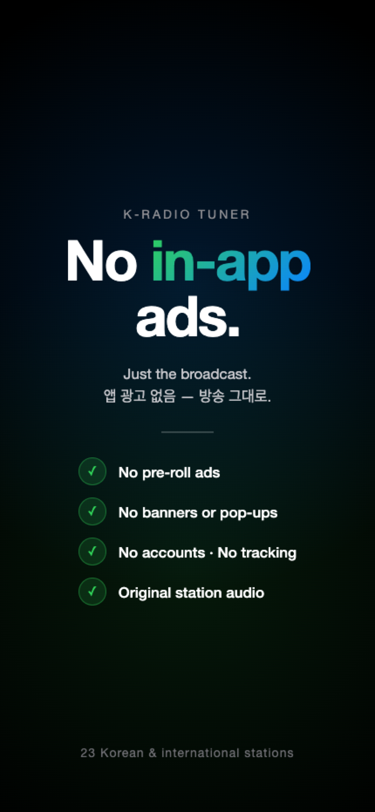
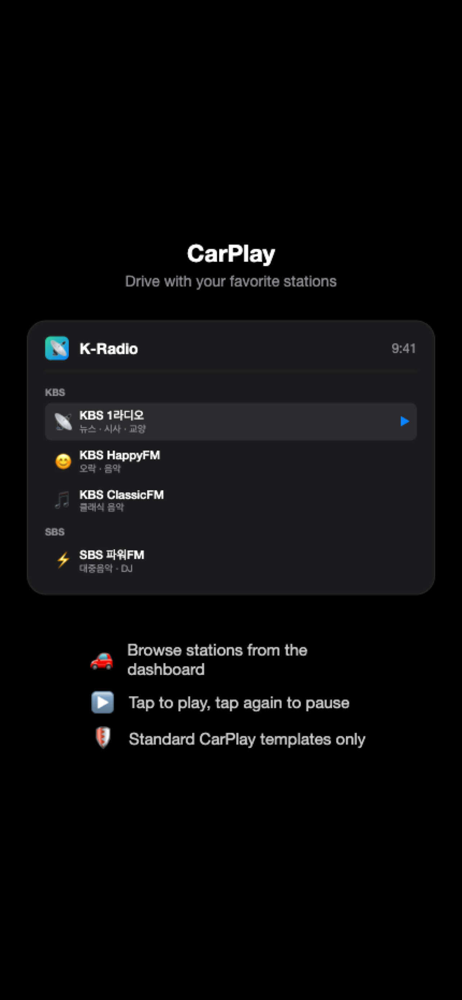
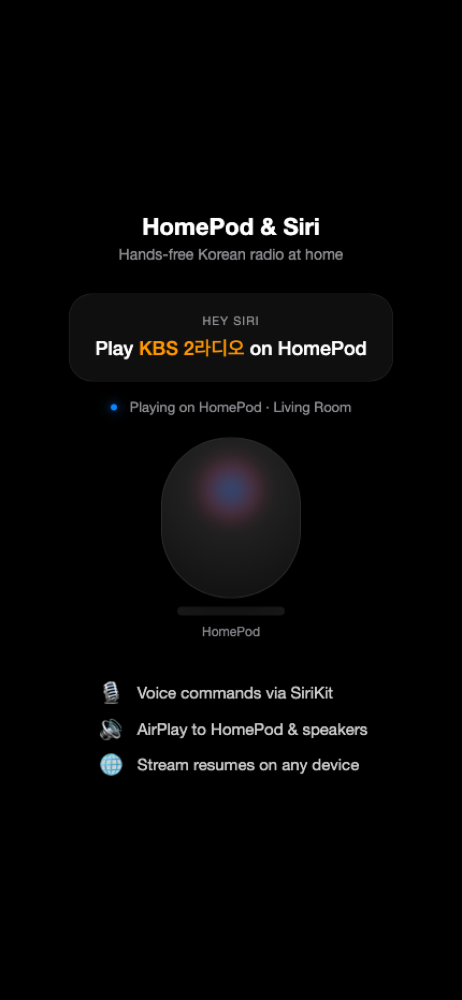

# K-Radio Tuner

**Korean radio with no in-app ads.**

Stream 23 live radio stations from Korea and around the world — without K-Radio adding a single ad of its own. KBS, MBC, SBS, CBS, TBS, EBS, YTN, and BBC, on iPhone, iPad, Apple Watch, CarPlay, and HomePod.

---

  
  &nbsp;
  
  &nbsp;
  
  &nbsp;
  

---

## Why K-Radio Tuner?

Most radio apps are cluttered with ads, require accounts, or bury Korean stations behind endless menus. K-Radio Tuner is different — it launches straight to your stations, plays instantly, and works across every Apple device you own.

- **No account required.** Open the app, tap a station, listen.
- **No in-app ads.** No pre-rolls, banners, or pop-ups added by us. Broadcasts play exactly as they air.
- **No tracking.** Your data stays on your device. Period.

## Stations

| Network | Stations |
|---------|----------|
| **KBS** | 1라디오, HappyFM, 3라디오, ClassicFM, CoolFM, 한민족방송 |
| **MBC** | 표준FM, FM4U, mini 올댓뮤직 |
| **SBS** | 파워FM, 러브FM, 고릴라디오M |
| **CBS** | 표준FM, 음악FM |
| **TBS** | FM, eFM |
| **EBS / YTN** | EBS FM, YTN 라디오 |
| **BBC** | Radio 1, Radio 2, Radio 3, Radio 4, World Service |
| **Custom** | Add any HLS, MP3, or AAC stream URL |

## Features

### Listen Anywhere
Background audio playback with full lock screen and Control Center integration. AirPlay to HomePod, speakers, or any AirPlay device. Start listening and put your phone away — K-Radio keeps playing.

### CarPlay
Browse and control your stations from the car dashboard using standard CarPlay templates. Tap to play, tap again to pause. Loading and paused states are shown right in the list.

  

### Apple Watch Companion
Listen directly from your wrist — no iPhone needed. Pair Bluetooth headphones to the Watch and the app streams independently. Your station list and custom additions sync via iCloud automatically.

  

The Watch app is available with an optional subscription:

| Plan | Price |
|------|-------|
| **Yearly** | $8.99/year (save 25%) |
| **Monthly** | $0.99/month           |

A 7-day free trial is included for new subscribers.

### HomePod &amp; Siri
Ask Siri to play your favorite station on HomePod, AirPods, or any speaker — hands-free.

  

### Make It Yours
Swipe to edit or remove any station. Add your own stations by URL. Reset to defaults anytime — your custom stations are kept. Settings sync across iPhone, iPad, and Apple Watch via iCloud.

  

### Now Playing
See what's on air with program titles and station artwork. One-tap play/pause from the lock screen, Control Center, watch face, CarPlay, or HomePod.

  

### Built for Reliability
Streams drop sometimes — K-Radio handles it. Auto-recovery reconnects when a stream stalls. For KBS, MBC, and SBS, the app automatically falls back to direct broadcaster APIs if the proxy is unavailable. Your last station is remembered across launches so you pick up right where you left off.

## Supported Languages

- English
- Korean (한국어)

## Requirements

- iPhone / iPad: iOS 16+
- Apple Watch: watchOS 9+ (with subscription)
- CarPlay: any CarPlay-compatible vehicle
- HomePod: HomePod, HomePod mini, or any AirPlay 2 speaker

## Privacy

K-Radio Tuner does not collect any personal data. No accounts, no analytics, no tracking. Your custom stations and preferences sync across your own devices via iCloud Key-Value storage — nothing is sent to our servers.

[Privacy Policy](privacy-policy.html) | [Terms of Use](terms-of-use.html)
[개인정보 처리방침](privacy-policy-ko.html) | [이용약관](terms-of-use-ko.html)

## Links

- [App Store](https://apps.apple.com/app/id6761031039)
- [Privacy Policy](https://nvisio.github.io/kradio/privacy-policy.html)
- [Terms of Use](https://nvisio.github.io/kradio/terms-of-use.html)
- [Support](https://github.com/nvisio/kradio)

---

Made by [nvisio](https://nvis.io/)
