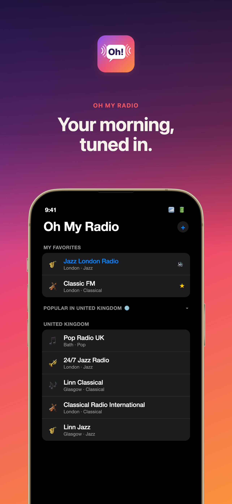
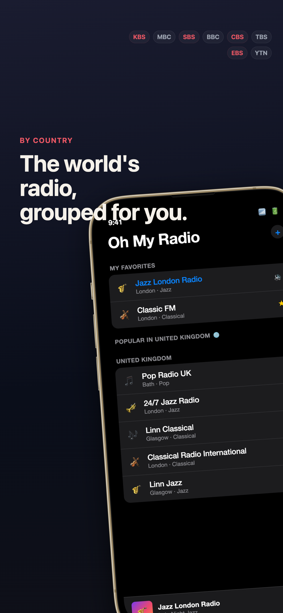
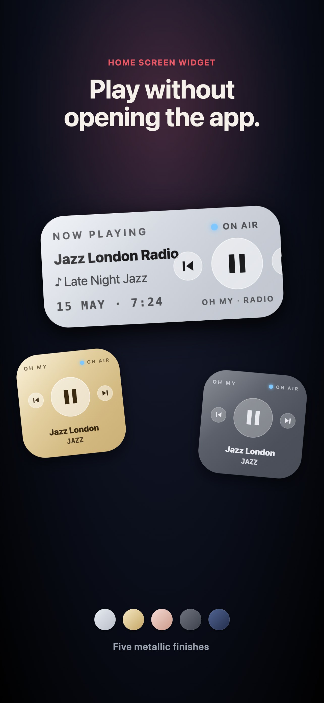
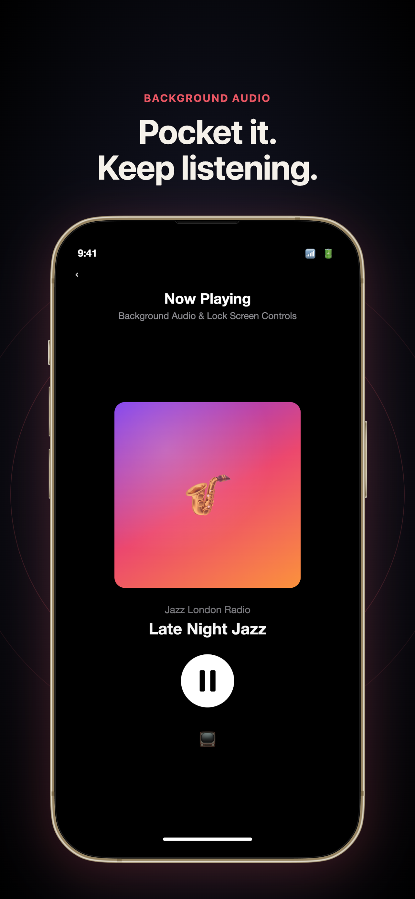
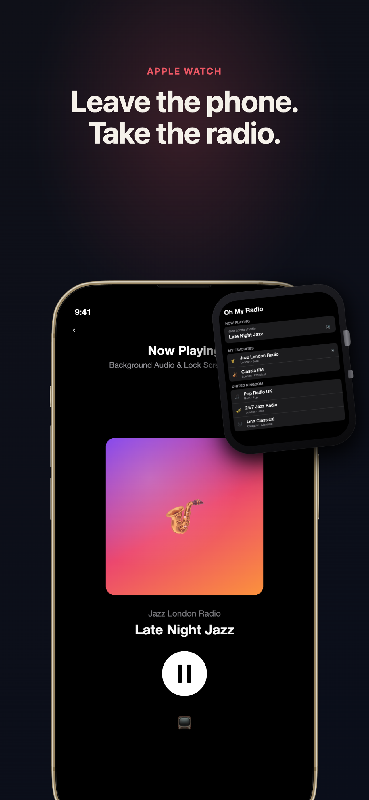
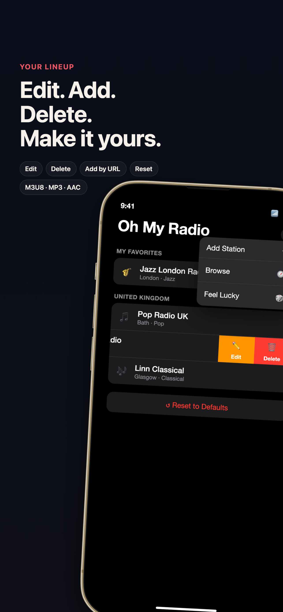
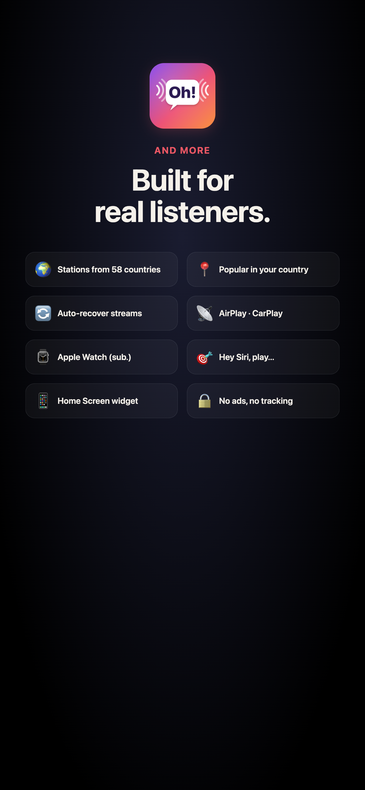

# Oh My Radio

**Live radio with no in-app ads.**

Stream live radio from Korea, Japan, the UK, and around the world — without Oh My Radio adding a single ad of its own. National broadcasters like KBS, MBC, SBS, BBC, and a browsable global catalogue, on iPhone, iPad, Apple Watch, CarPlay, and HomePod.

---

  
  &nbsp;
  
  &nbsp;
  
  &nbsp;
  
  &nbsp;
  
  &nbsp;
  
  &nbsp;
  

---

## Why Oh My Radio?

Most radio apps are cluttered with ads, require accounts, or bury Korean stations behind endless menus. Oh My Radio is different — it launches straight to your stations, plays instantly, and works across every Apple device you own.

- **No account required.** Open the app, tap a station, listen.
- **No in-app ads.** No pre-rolls, banners, or pop-ups added by us. Broadcasts play exactly as they air.
- **No tracking in the app.** Your in-app data stays on your device. Period. *(The web catalogue records anonymous aggregate click counts — station name + page + date — to see which stations are popular. No identifiers, no cookies, no third-party services.)*

## Stations

A browsable catalogue of **37,000+ live stations across 226 countries** —
explore by country, genre, or language and open any of them in the app with a
tap.

| | |
|---|---|
| **Popular by country** | A curated "popular" pool for 56 storefronts, surfaced in-app and rotatable |
| **The full catalogue** | 37,000+ stations worldwide — [browse and filter](https://kradio.nvis.io/stations.html) by country / genre / language |
| **Your own** | Add any HLS, MP3, or AAC stream URL |

> Browse the whole world at **[kradio.nvis.io/stations.html](https://kradio.nvis.io/stations.html)** — tap a station to open it in Oh My Radio.

## Features

### Listen Anywhere
Background audio playback with full lock screen and Control Center integration. AirPlay to HomePod, speakers, or any AirPlay device. Start listening and put your phone away — Oh My Radio keeps playing.

### CarPlay
Browse and control your stations from the car dashboard using standard CarPlay templates. Tap to play, tap again to pause. Loading and paused states are shown right in the list.

### Apple Watch Companion
Listen directly from your wrist — no iPhone needed. Pair Bluetooth headphones to the Watch and the app streams independently. Your station list and custom additions sync via iCloud automatically.

The Watch app is available with an optional subscription:

| Plan | Price |
|------|-------|
| **Yearly** | $8.99/year (save 25%) |
| **Monthly** | $0.99/month           |

A 7-day free trial is included for new subscribers.

### HomePod &amp; Siri
Ask Siri to play your favorite station on HomePod, AirPods, or any speaker — hands-free.

### Wake Up to Radio (Shortcuts Recipe)

iOS's built-in Clock alarm only accepts Apple Music tracks as the sound, so Oh My Radio can't replace the alarm itself. Instead, use **Shortcuts** to start a station at a scheduled time and route the audio to a HomePod or any AirPlay 2 speaker.

**iPhone → HomePod, daily at 7:00 am**

1. Open the **Shortcuts** app → **Automation** tab → **+** → **Time of Day**. Set the time and repeat, then turn **Run Immediately** on.
2. Add these actions in order:
   - **Set Playback Destination** → pick your HomePod *(iOS 17+)*.
   - **Open URL** → `kradio://play?name=KBS%20Cool%20FM&url=<streamURL>`
     *(grab a ready-made link from [the station catalogue](https://kradio.nvis.io/stations.html))*
   - *(optional)* **Wait** 1 Hour → **Pause** *(Now Playing)*.

At the scheduled time the iPhone wakes Oh My Radio and the station streams to your HomePod via AirPlay 2. The same recipe works with an "Alarm Stopped" trigger if you want the radio to start the moment you dismiss your usual Clock alarm.

> **Direct HomePod scheduling** (no iPhone in the loop) requires Apple's *SiriKit Media Intents for HomePod* program approval — our submission is pending. Until it's granted, the iPhone-mediated recipe above is the most reliable way to use Oh My Radio as a radio alarm.

### Make It Yours
Swipe to edit or remove any station. Add your own stations by URL. Reset to defaults anytime — your custom stations are kept. Settings sync across iPhone, iPad, and Apple Watch via iCloud.

### Now Playing
See what's on air with program titles and station artwork. One-tap play/pause from the lock screen, Control Center, watch face, CarPlay, or HomePod.

### Built for Reliability
Streams drop sometimes — Oh My Radio handles it. Auto-recovery reconnects when a stream stalls. For KBS, MBC, and SBS, the app automatically falls back to direct broadcaster APIs if the proxy is unavailable. Your last station is remembered across launches so you pick up right where you left off.

## Supported Languages

- English
- Korean (한국어)

## Requirements

- iPhone / iPad: iOS 16+
- Apple Watch: watchOS 9+ (with subscription)
- CarPlay: any CarPlay-compatible vehicle
- HomePod: HomePod, HomePod mini, or any AirPlay 2 speaker

## Privacy

Oh My Radio does not collect any personal data. No accounts, no analytics, no tracking. Your custom stations and preferences sync across your own devices via iCloud Key-Value storage — nothing is sent to our servers.

[Privacy Policy](privacy-policy.html) | [Terms of Use](terms-of-use.html)
[개인정보 처리방침](privacy-policy-ko.html) | [이용약관](terms-of-use-ko.html)

## Links

- [App Store](https://apps.apple.com/app/apple-store/id6761031039?pt=128692952&ct=landing_page&mt=8)
- [Station Catalogue](https://kradio.nvis.io/stations.html)
- [Privacy Policy](https://kradio.nvis.io/privacy-policy.html)
- [Terms of Use](https://kradio.nvis.io/terms-of-use.html)
- [Support](https://github.com/nvisio/kradio)

---

Made by [nvisio](https://nvis.io/)
