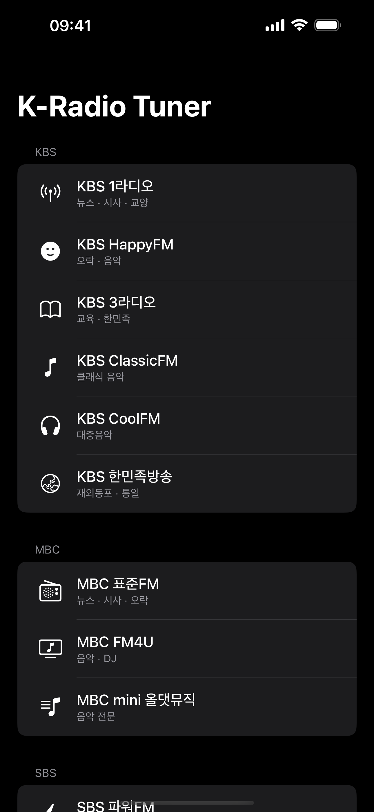
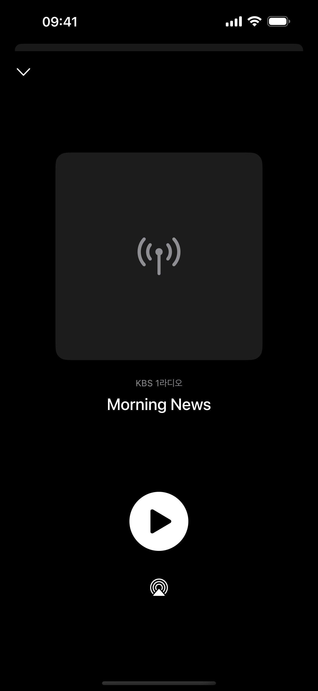
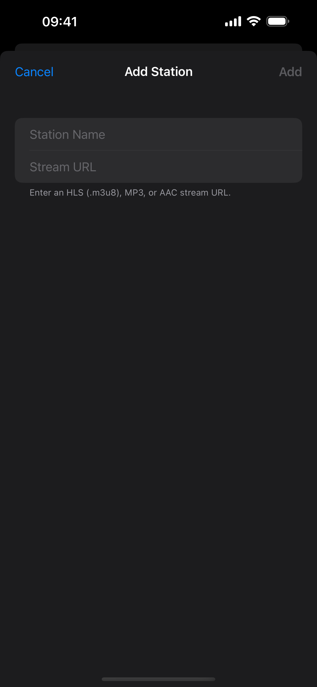
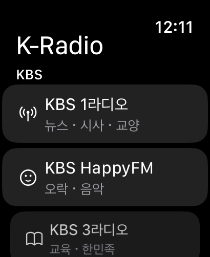
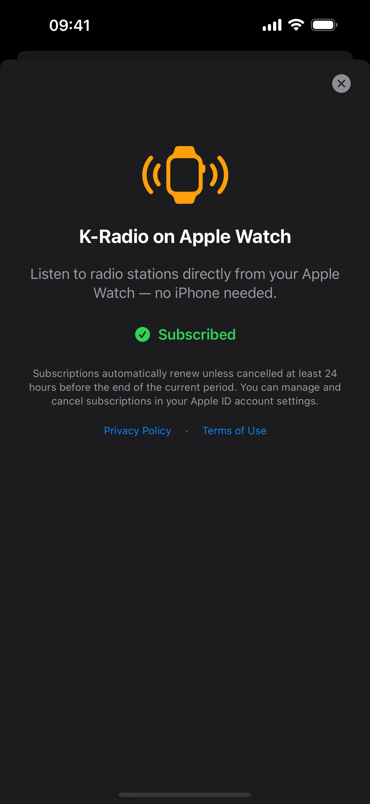

# K-Radio Tuner

**Korean & World Radio — One Tap Away**

Stream 21+ radio stations from Korea and around the world. KBS, MBC, SBS, CBS, TBS, EBS, YTN, and BBC — all in one beautifully simple app.

---

  
  &nbsp;&nbsp;
  
  &nbsp;&nbsp;
  

---

## Why K-Radio Tuner?

Most radio apps are cluttered with ads, require accounts, or bury Korean stations behind endless menus. K-Radio Tuner is different — it launches straight to your stations, plays instantly, and stays out of your way.

- **No account required.** Open the app, tap a station, listen.
- **No ads.** Ever. The app is clean and distraction-free.
- **No tracking.** Your data stays on your device. Period.

## Stations

| Network | Stations |
|---------|----------|
| **KBS** | 1라디오, HappyFM, 3라디오, ClassicFM, CoolFM, 한민족방송 |
| **MBC** | 표준FM, FM4U |
| **SBS** | 파워FM, 러브FM |
| **CBS** | 표준FM, 음악FM |
| **TBS** | FM, eFM |
| **EBS / YTN** | EBS FM, YTN 라디오 |
| **BBC** | Radio 1, Radio 2, Radio 3, Radio 4, World Service |
| **Custom** | Add any HLS, MP3, or AAC stream URL |

## Features

### Listen Anywhere
Background audio playback with full lock screen and Control Center integration. AirPlay to your speakers. Start listening and put your phone away — K-Radio keeps playing.

### Make It Yours
Swipe to edit or remove any station. Add your own stations by URL. Reset to defaults anytime. Your lineup, your way.

  

### Now Playing
See what's on air with program titles and artwork. One-tap play/pause. Sleep timer auto-stops playback after 60 seconds of pause so you never drain your battery.

  

### Apple Watch Companion

Listen directly from your wrist — no iPhone needed. Your station list syncs automatically. Now Playing controls right on your watch face.

  

The Watch app is available with an optional subscription:

| Plan | Price |
|------|-------|
| **Yearly** | $7.99/year (save 33%) |
| **Monthly** | $0.99/month |

  

### Built for Reliability
Streams drop sometimes — K-Radio handles it. Auto-recovery reconnects when a stream stalls. Your last station is remembered across launches so you pick up right where you left off.

## Supported Languages

- English
- Korean (한국어)

## Requirements

- iPhone: iOS 16+
- Apple Watch: watchOS 9+ (with subscription)

## Privacy

K-Radio Tuner does not collect any personal data. No accounts, no analytics, no tracking. Station preferences are stored locally on your device and synced to your Apple Watch via Watch Connectivity. That's it.

[Privacy Policy](privacy-policy.html) | [Terms of Use](terms-of-use.html)
[개인정보 처리방침](privacy-policy-ko.html) | [이용약관](terms-of-use-ko.html)

## Links

- [App Store](https://apps.apple.com/app/k-radio-tuner/id0000000000)
- [Privacy Policy](https://nvisio.github.io/kradio/privacy-policy.html)
- [Terms of Use](https://nvisio.github.io/kradio/terms-of-use.html)
- [Support](https://github.com/nvisio/kradio)

---

Made by [nvisio](https://nvis.io/)
